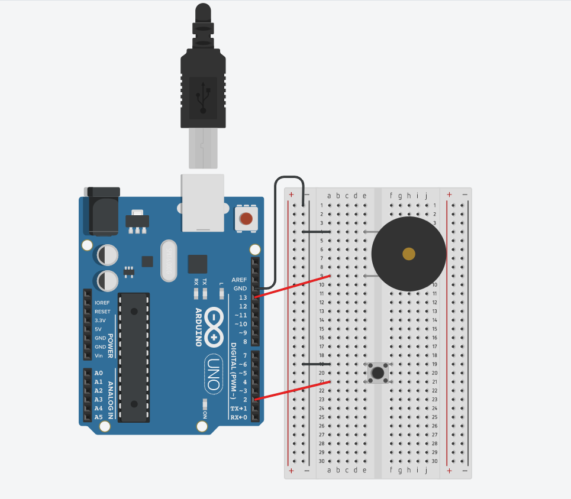

# This project was created using tinkercad simulator

It is a small demo which uses a lot of different concepts im learning to really solidify my knowledge on Arduino and Programming circuits
I use a for loop to create a tone one button is pushed and stop sound when switch is released.

