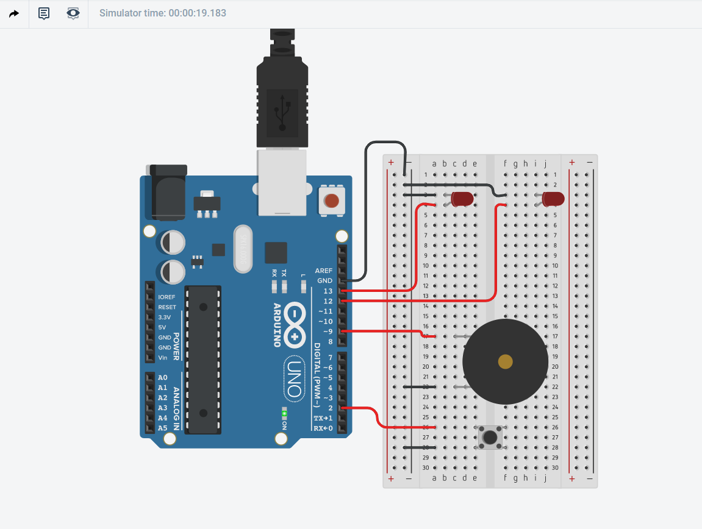

# This project was created using tinkercad simulator

It is a small demo which uses a lot of different concepts im learning to really solidify my knowledge on Arduino and Programming circuits
I use serial print to know when a button is pressed I make lights turn on and off and make a random switch for as long switch is pressed when it is released the noise and lights go off.

