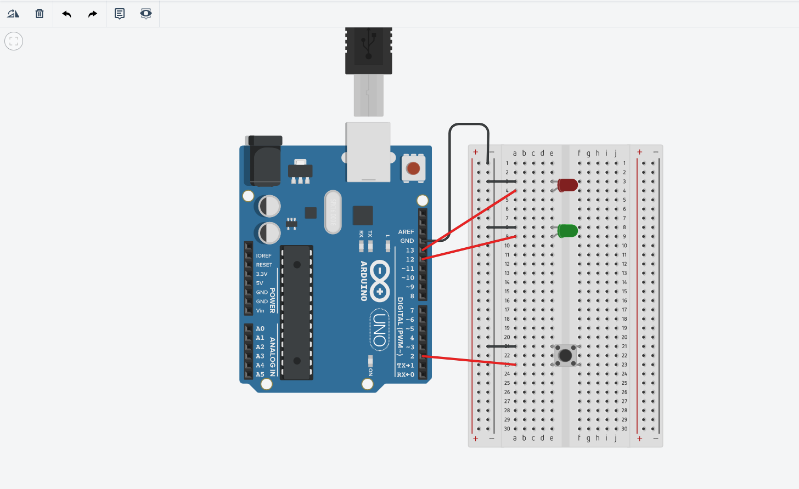

# This project was created using tinkercad simulator

It is a small demo which uses a lot of different concepts im learning to really solidify my knowledge on Arduino and Programming circuits
I use serial print to know when a button is pressed I make a random yes or no based on whether red or green light is turned on

